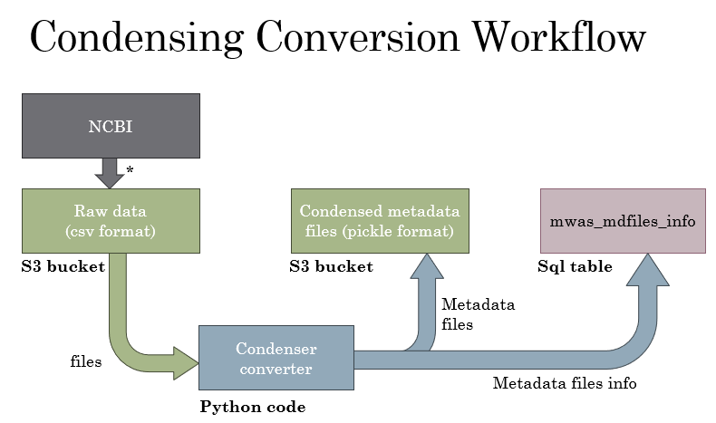
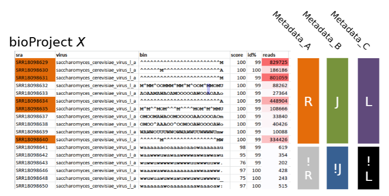
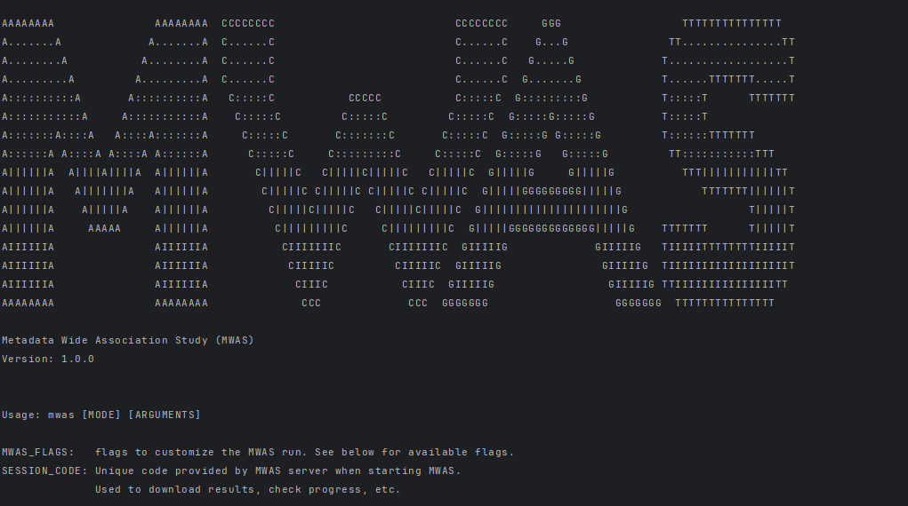

#  MWAS (Metadata Wide Association Study)

MWAS is a tool that uses statistical analysis to find correlations between metadata sourced from NCBI BioSample database and quantifiable observations for each biosample provided by the user. 

# Notes:
- Statistical tests in MWAS compare a set of 'true' biosamples (i.e. those that have a certain metadata field:value), to a set of 'false' biosamples (i.e. those that do not have that metadata field:value) 
- The two sets are composed of rpm (read per million) values derived from the value provided by the user and then normalized via the spot count of the biosample. (users can specify if their data is already normalized)
- The user should also provide "group" classifications to each biosample, and so MWAS will run tests on subsets of the user's data, where each subset is filtered by the group. 
- The statistical tests are per-bioproject, so each test contains a collection of biosamples within a specific bioproject.
- By default, the user data is assumed to have implicit zeros, that is, if a biosample is not provided for a group, it is assumed to have quantification of 0, so statistical tests will always incorporate every biosample in the bioproject.
- The user can specify that their data is explicit zeros, in which case MWAS will ignore biosamples that are not provided for a group. This can may to ignoring metadata field:value tests, groups or even Bioprojects. Therefore, it's recommended to provide as much data as possible if using this mode.
- T-tests are used when comparing one of the true sets has less than 4 biosamples
- Otherwise, permutation tests are used. Note: permutation tests use up to 10,000 permutations to calculate p-values.
- Certain metadata fields are ignored by default, e.g. publication_date, last_update, etc.
- For every bioproject that contains a biosample in the user's input, MWAS will run N statistical tests, where N is the number of notable metadata field:value categories in the bioproject.
- Notable metadata field:value categories satisfy these conditions:
    - The field has at least 2 unique values
    - The field can't be entirely composed of unique values
    - There are more than 3 biosamples in the bioproject.
    - A field:value category may be the "not provided" category (it isn't ignored)
    - The number of biosamples in the field:value category is at least 2
- Certain bioprojects are ignored by default:
  - Bioprojects with less than 4 biosamples
  - Bioprojects with less than 2 notable metadata field:value categories
  - Bioprojects that are unavailable in the NCBI
  - Bioprojects that are blacklisted due to large size (there are less than 50 of these)
  - Possibly, if MWAS's metadata database is outdated, bioprojects may be ignored
  - If user data is explicit zeroes, then Bioprojects containing not enough non-zero values are ignored. Additionally, the same apllies to ignoring groups within a bioproject.
- Test results consist of a p-value, fold-change, test-statistic, mean & standard deviation of both the true and false sets, and the number of biosamples in each set.
  - The user can specify a p-value threshold to filter out insignificant results. Default is 0.005
  - Significant results will also report all the biosamples in the true and false sets, as long as there are under 200 biosamples to report
  - Each test result corresponds to a metadata field:value category + group + bioproject combination. It intends to convey the correlation between the metadata field:value category and the group. The bioproject is just for reference (of which biosamples were used in the test)
  - The type of test used (t-test or permutation test) is also reported in the results
- If you have a large amount of data (over 5 million runs), it is recommended to split the data into multiple files.
  - Preferably, split by bioproject (this may be hard to tell, as we don't expect you to know the bioprojects), as opposed to splitting by groups. This way, it'll be much more efficient to run due to how MWAS batches jobs and parallelizes tests.

# Input Format
- The user must provide a CSV file with the following columns:
  - run_accession: am SRA run accession number (MWAS will find the biosample associated with this run)
  - group: The group classification of the run (note: run_accession + group combinations must be unique within the file, but run_accessions can be repeated)
  - quantification: The quantifiable observation for the run (e.g. n_reads. MWAS will normalize this value with the spot count of the biosample by default)
- The columns must be in this order. The header row must be present, but the column names are arbitrary.

# MWAS dependencies
- For the user, you just need to run the MWAS shell script. The shell script will notify you if you are missing any dependencies for the script.
- The shell script is a front to send a request to a serverless function that starts the MWAS workflow.
- The following dependencies are 'server-side' and their mentioning here are for informational purposes:
  - AWS S3 bucket - to store MWAS run data. Also, this is where the condensed metadata files that MWAS uses to run tests are stored.
  - AWS Lambda (preprocessing function, statistical test function, and postprocessing function)
  - AWS SNS - handle lambda dispatching
  - AWS dynamoDB - handle lambda notifications
  - AWS EC2 - server dedicated to updating the metadata database. This is done periodically (this should be done by the developers, not the user)
  - Logan SRA - Serratus database for retrieving biosample, bioproject, spots for user data run list
  - NCBI - for retrieving metadata for bioprojects (part of metadata condensation workflow)
  - mwas_mdfile_info - Serratus database for metadata-file metadata (info about the metadata files)

# Workflow
Workflow for one MWAS run: (standard serverless)
.jpg)
(Note: this diagram is outdated, needs updating)

Workflow for updating the metadata database:

# Statistical Test Visualization
The intuition for MWAS:

# Installation
<ol>
  <li>Download the shell script <code>mwas.sh</code></li>
  <li>Run <code>./mwas.sh -h</code> in your linux terminal to see the help menu.</li>
  <li>
    
You should see the following output: (it may look slightly different depending on your terminal width)

    
  </li>
  <li>Follow instructions in the help menu to run MWAS</li>
</ol>

*note: for now, avoid running MWAS on massive datasets, as it might cause a bug that needs to be fixed.* 
